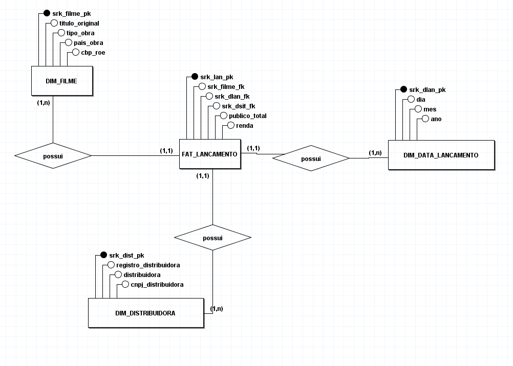
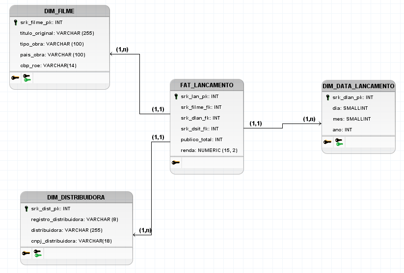

## Modelo Entidade-Relacionamento (ME-R)

### ENTIDADES DIMENSONAIS

* DIM_DISTRIBUIDORA

* DIM_FILME

* DIM_DATA_LANCAMENTO

### ENTIDADE DE FATOS

* FAT_LANCAMENTO

### ATRIBUTOS

* DIM_DISTRIBUIDORA (<u>srk_dis</u>, registro_distribuidora, distribuidora, cnpj_distribuidora)

* DIM_FILME (<u>srk_filme</u>, titulo_original, tipo_obra, pais_obra, cbp_roe)

* DIM_DATA_LANCAMENTO (<u>srk_dla</u>, dia, mes, ano)

* FAT_LANCAMENTO(<u>srk_lan</u>, srk_filme, srk_dla, srk_dis, publico_total, renda_total)

### RELACIONAMENTOS

#### DIM_FILME → FAT_LANCAMENTO
- **Cardinalidade**: 1:N (Um para Muitos)
- **Descrição**: Um filme pode ter múltiplos lançamentos registrados (em diferentes distribuidoras, datas, etc.)

#### DIM_DATA_LANCAMENTO → FAT_LANCAMENTO
- **Cardinalidade**: 1:N (Um para Muitos)
- **Descrição**: Uma data pode estar associada a múltiplos lançamentos de filmes

#### DIM_DISTRIBUIDORA → FAT_LANCAMENTO
- **Cardinalidade**: 1:N (Um para Muitos)
- **Descrição**: Uma distribuidora pode ter múltiplos lançamentos de filmes ao longo do tempo

## Diagrama Entidade-Relacionamento (DER)

## Diagrama Lógico de Dados (DLD)

